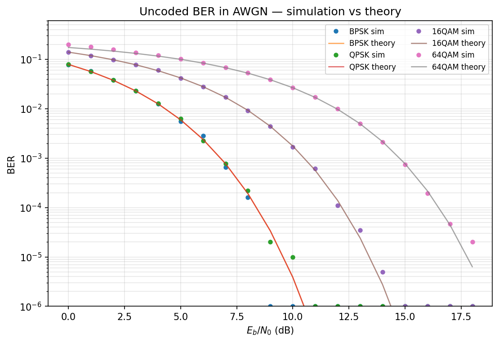
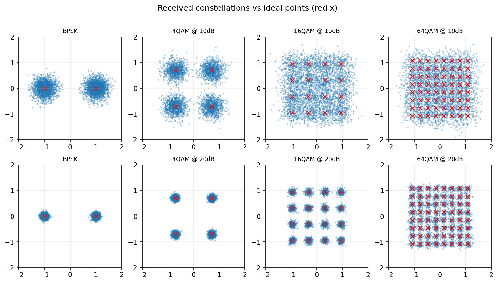

# 01 总览与架构

## 这个项目在干什么

用 Python（只用 NumPy/SciPy，不用现成通信库）把一条数字通信物理层收发链路**从比特到比特**完整实现出来，再用这条链路"自己产数据"，训练一个深度神经网络识别信号的调制方式。

一句话版本（可直接用于自我介绍）：

> "我用 Python 从零实现了一套数字通信物理层仿真平台：从信源编码、调制、成型滤波，到多径信道、定时同步、载波同步、信道估计与均衡，链路误码率全程与理论曲线对齐；在此之上还实现了 OFDM 收发机（参照 5G NR 参数）和基于深度学习的自动调制识别。"

## 为什么要分这么多模块

真实收发机的每一级都是为了对付一个具体的物理问题。链路图上的每个框，面试官都可以顺着问下去——所以本项目刻意按"一级一个问题"组织：

| 模块 | 对付的物理问题 | 对应的课本章节 |
|---|---|---|
| 信道编码 | 随机错误 → 加冗余纠错 | 信道编码/差错控制 |
| 数字调制 | 比特 → 波形 | 调制解调 |
| 成型滤波 | 限制带宽 + 消除码间串扰 | 奈奎斯特准则 |
| 信道 | 噪声、多径、频偏 | 信道模型 |
| 同步 | 收发时钟/载波不一致 | 载波同步、位同步 |
| 信道估计+均衡 | 多径造成的码间串扰 | 均衡技术 |
| OFDM | 把频率选择性信道变成一堆平坦子信道 | 多载波调制 |
| AMC | 接收端不知道调制方式时怎么识别 | AI+通信 |

## 代码地图

```
src/phylayer/
├── modulation.py      # Modem 类：调制、硬判决、逐比特 LLR、理论 BER
├── pulse_shaping.py   # RRC 滤波器、上采样
├── coding.py          # 卷积码 + Viterbi（硬/软判决）
├── channels.py        # AWGN、瑞利/莱斯多径、CFO、相位噪声
├── sync.py            # 前导帧定时、CFO 估计、Costas 相位跟踪
├── equalizer.py       # ZF / MMSE 均衡
├── ofdm.py            # OFDM 收发机（含 Schmidl-Cox 定时）
├── chan_est.py        # LS / DFT 插值 / LMMSE 信道估计
├── metrics.py         # BER / SER / EVM
└── iqdata.py          # 带标注 I/Q 数据集生成
```

## 怎么验证"仿真没写错"

每级都用**和理论对齐**的方式验证，而不是"看着差不多"：

- 调制：仿真 BER 逐点压在理论曲线上（见下图，点=仿真，线=理论）
- 成型：收发两个 RRC 级联 = 升余弦，码间串扰实测 < 1e-4
- 编码：Viterbi 软判决相对未编码有预期的编码增益
- OFDM：平坦衰落信道下逐子载波恢复误差受控





## 约定（贯穿全项目）

- 所有调制符号**平均能量归一化为 1**，所以不同调制阶数之间 SNR 可直接比较。
- `snr_db` 一律指**符号级 Es/N0**；加到过采样波形时换算为 `Es/N0 − 10·log10(sps)`。
- Eb/N0 与 Es/N0 的换算：`Es/N0 = Eb/N0 + 10·log10(log2 M)`。

!!! tip "面试常问"
    "Es/N0 和 Eb/N0 什么关系？" —— 每符号能量 = 每比特能量 × 每符号比特数。所以 Es/N0 = Eb/N0·k，k=log₂M。QPSK 的 Eb/N0 比 Es/N0 低 3 dB。
