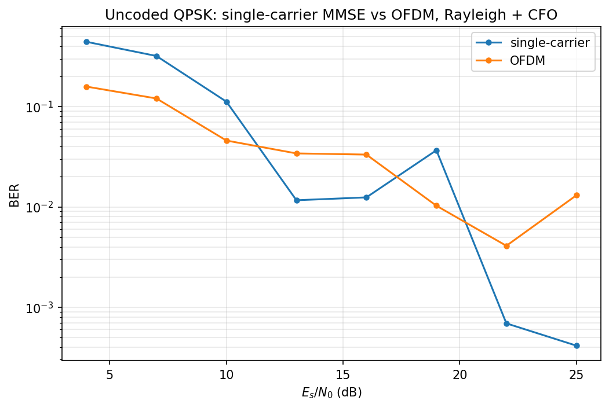
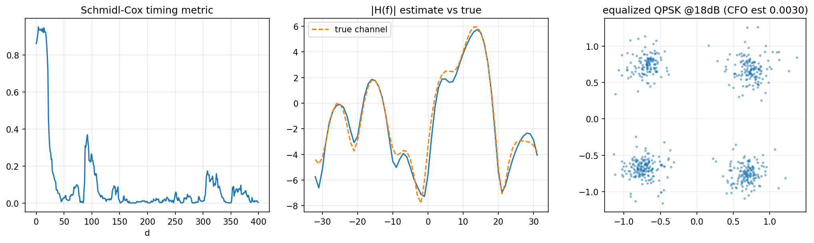

# 08 OFDM 收发机

> 代码：`src/phylayer/ofdm.py`，实验：`experiments/exp04_ofdm_link.py`
> 上游：模块 06 的同步思想、模块 07 的"信道卷积"框架
> 一句话：把宽带频率选择性信道切成 64 个窄带平坦子信道，均衡退化为每个
> 载波除一个复数。

## 它解决什么问题

模块 07 的时域均衡在多径信道上能用，但有两个本质代价：

1. 时域均衡器要解 $L_w$ 阶线性正规方程，构造方程的 Toeplitz 矩阵规模随
   $L_h+L_w$ 增长——复杂度随信道长度增长；
2. 信道频谱的深凹点上，MMSE 也只能折中——ISI 消了，该频点信噪比还是差。

OFDM 换了一条更聪明的思路：**不做时域均衡，让 ISI 在结构上消失**。原理
分两步：

- **拉长符号周期**：把几十个 QAM 符号并排放在正交子载波上，一个
  OFDM 符号持续 $N=64$ 个采样——多径那点儿拖尾相对超长符号周期变得可以
  忽略；
- **加循环前缀 CP**：把符号尾部 $N_{cp}$ 个采样复制到前面，让信道的
  **线性卷积**在接收窗口内表现得像**循环卷积**。

循环卷积在 DFT 域里是对角阵（复指数是循环卷积矩阵的特征向量），于是

$$
Y=\mathrm{DFT}(h\circledast x)=H\odot X
$$

每个子载波上信道退化成一个**复数标量** $H_k$——均衡就是逐载波除一下。
这就是 OFDM 取代单载波均衡的核心卖点：**把频率选择性信道切成一堆
平坦衰落子信道**。

## 帧结构（对照 802.11a 设计）

```
[ S&C 同步前导 (CP+64) | 训练符号 (CP+64) | 数据 OFDM 符号 × N (各 CP+64) ]
```

- **同步前导**：只偶数载波携带 PN 序列 → 时域 64 点呈"前 32 = 后 32"
  两半重复结构 → Schmidl–Cox 定时 + CFO 粗估；
- **训练符号**：全部 62 个可用载波放已知 BPSK → 一步 LS 信道估计；
- **数据符号**：58 数据载波 + 4 导频载波（`{6,18,42,54}`）→ 导频放
  已知 PN，用于逐符号残余相位跟踪（CPE）。

载波规划：DC(0) 与 Nyquist(32) 置零——工程惯例（DC 受本振泄漏污染，
Nyquist 在抗混叠滤波器边缘）。

## 原理

### CP 为什么能把卷积变成除法

信道线性卷积写成矩阵是带状 Toeplitz；DFT 矩阵的特征向量是复指数，
而**循环** Toeplitz 矩阵恰好被 DFT 对角化：

$$
Y=\mathrm{DFT}(h\circledast x)=H\odot X
$$

CP 的作用正是"伪装"循环卷积：把符号尾部 $N_{cp}$ 个采样复制到头部，
信道输出在主体窗口内的效果和循环卷积完全一致——**条件是 CP 长度 ≥
信道拖尾长度**。这是 OFDM 唯一真正"烧钱"的地方：16/80 = 20% 的带宽
开销换"均衡变成除法"。

**临界细节——FFT 窗的位置**：窗口可以比符号体**早**，但有上界：偏早量
$\le N_{cp}-(L-1)$——窗内完整装下信道拖尾时才是合法循环移位，被吸收进
$H$ 的线性相位项；偏早更多同样会抓到上一符号的延拓尾部。窗口绝不能
**晚**（窗尾会抓到下一个符号的 CP 样本，不属于本符号的循环延拓 → ISI 直接
进窗）。这是调通接收机时实际踩到的坑：同步估计偏晚 4 个采样，整帧
误码率 50%。

### Schmidl–Cox 定时

前导时域两半相同 → 滑动相关：

$$
P(d)=\sum_{m=0}^{L-1} r^*[d+m]\,r[d+m+L],\qquad
R(d)=\sum_{m=0}^{L-1}|r[d+m+L]|^2,\qquad
M(d)=\frac{|P(d)|^2}{R(d)^2}
$$

噪声区 $M\approx0$；进入前导后，两半样本只差一个 CFO 公共相位（调制
部分被共轭乘积消去），$|P(d)|\to R(d)$、$M\to1$ 形成
**平台**。平台宽约 $N_{cp}-(L_h-1)$（无多径时即 $N_{cp}$）——粗定时够了，精确点还得下一步。

### CFO 估计（两半相关）

相隔 $L=N/2$ 的两样本在 CFO $\epsilon$（归一化）下差固定相位
$e^{j2\pi\epsilon L}$：

$$
\hat\epsilon=\frac{1}{2\pi L}\angle\sum r^*[d]\,r[d+L]
$$

和模块 06 的 Moose 是同一个思想：重复结构把频偏转成可测相位差。

**CFO 不补会怎样——ICI 定量**：以子载波间隔归一化的频偏
$\epsilon=\Delta f\cdot T_u$（exp04 注入的 $\Delta f=3\times10^{-3}$ 周/样点
对应 $\epsilon=0.192$），载波 $l$ 的接收符号变为

$$
Y_l = s_0 X_l + \sum_{k\neq l}s_{k-l}X_k,\qquad
|s_m|=\frac{\sin\pi(m+\epsilon)}{N\left|\sin\frac{\pi(m+\epsilon)}{N}\right|}
$$

（严格式里 $s_m$ 还带一个公共相位因子 $e^{j\pi(m+\epsilon)(N-1)/N}$，
只影响相位、不影响功率分配，这里省去。）

有用信号被压成 $|s_0|^2\approx 1-(\pi\epsilon)^2/3$，泄漏出的能量即
**载波间干扰 ICI**：由 Parseval，$\sum_m|s_m|^2=1$，所以

$$
P_{\mathrm{ICI}}=1-|s_0|^2\approx\frac{(\pi\epsilon)^2}{3}
$$

代入 $\epsilon=0.192$：ICI ≈ **−9.4 dB（11%）**——ICI 不可压，
相当于把每个载波的有效 SNR **钉死在 ~9.4 dB 上限**：QPSK 也压出
~3×10⁻³ 的误符号地板，16QAM ~26%、64QAM ~70% 基本报废。
而 Moose 估计+补偿后的残余频偏 ~3.5×10⁻⁵ 周/样点（ε≈2×10⁻³）
对应 ICI ≈ −48 dB，完全淹没在噪声里——**这就是 OFDM 必须
先补 CFO 的定量理由**：不补是系统性灾难，补完代价可忽略。
另外频偏的整数部分 $\epsilon\ge1$ 不是
ICI 而是**载波整体错位**（导频/数据全挪一格），802.11a 靠长短前导
两级估计分别覆盖。

### 信道估计与时域降噪

训练符号全载波已知 → 逐载波 LS：

$$
\hat H_k = Y_k^{(tr)}/X_k^{(tr)}
$$

再做一步工程上必做的**时域降噪**：$\hat H\to$IFFT 得信道冲激响应估计
$\hat h$，把 CP 长度以外的抽头清零（真实信道拖尾不可能超 CP），再 FFT
回来。白噪声原本均摊在全部 64 个抽头，截断后只剩约 $N_{cp}/N$ 的噪声
能量——估计方差约降 6 dB。这就是"利用信道结构先验"。

### 逐符号残余相位跟踪（CPE）

CFO 估计有残差，随时间累积成相位斜坡；定时偏差/抖动在频域引入随载波
线性变化的相位斜坡，其公共分量也表现为残余相位误差。
每个数据符号用 4 个导频做**相干合并**估公共相位误差：

$$
\hat\theta=\angle\sum_{p\in\mathcal P}\frac{Y_p}{D_p}\,\hat H_p^{*}
$$

**为什么不能写 `mean(Y_p/(D_p·H_p))`**：深衰落导频上 $|H|\approx0$，
噪声被 $1/|H|$ 放大，一个坏导频毁掉整个 CPE。乘 $\hat H^*$ 后每项
贡献权重正比 $|H|^2$——弱导频自动降权（信道状态信息加权的微缩版）。
这是调试中真实抓到的问题：某导频恰好坐在信道零点，朴素平均给出
2.8 rad 的 CPE 误差，比不校正还糟。

## 代码走读（按调用顺序）

```python
frame = ofdm_tx(bits)          # sync_preamble + training + ofdm_modulate(加CP)
# ... 过信道 + 噪声 ...
syms = ofdm_rx(rx_wave)       # 前导匹配滤波+首径回扫 -> CFO -> derotate
                              # -> FFT窗(偏早2) -> LS估计+时域降噪
                              # (S&C 度量只算给演示图，定时全靠匹配滤波)
                              # -> 逐符号 CPE 校正 -> 除以 H_hat
```

## 实验结果

`exp04_ofdm_link.py`：瑞利 9 抽头多径 + CFO $3\times10^{-3}$，无编码 QPSK。

- 干净信道回环：误符号率 0；多径+CFO 无噪声：0。
- BER 曲线见 `assets/ofdm_ber.png`：低 SNR 下 OFDM 反而优于单载波
  （有限长 MMSE 均衡器在低 SNR 退化为匹配滤波，残留 ISI 不除；
  OFDM 把 ISI 化成每个载波上的平坦衰落，逐个补偿）；高 SNR
  下残留 ~1% 误码来自**深衰落载波上的迫零噪声放大**——这正是"OFDM
  必须配信道编码+载波间交织"的理由（模块 04 的卷积码+交织恰好是解药，
  WiFi 的 BCC 编码就是这么做的）。




## 面试可能怎么问

**Q：为什么 OFDM 需要 CP？CP 多长合适？**
A：CP 把线性卷积变成循环卷积，让 DFT 对角化信道矩阵；长度要 ≥ 信道
最大时延扩展。代价是带宽效率损失 $N_{cp}/(N+N_{cp})$。CP 不够长会引入
残余 ISI+ICI——本项目实测：CP=16 时信道拖尾 $L\le N_{cp}+1=17$ 理论上
无 ISI，留余量取 9 抽头实验安全；拖尾一旦超过 CP，ISI/ICI 进窗任何
同步位置都救不回来。

**Q：S&C 定时的平台问题怎么解决？**
A：平台宽约 $N_{cp}$、峰不锐利，多径下中点漂移。工程上要么加权化/差
分化，要么像本项目：S&C 只给粗范围，再匹配滤波已知前导 + 首径检测
精确定位（802.11 用长前导互相关）。

**Q：FFT 窗偏了会怎样？**
A：偏早合法但有上界（偏早量 $\le N_{cp}-(L-1)$：窗内完整装下信道拖尾，
循环移位才被 $H$ 吸收成线性相位项）；
偏晚=灾难（抓到下一符号的 CP，ISI 直接进窗）。所以接收机显式偏 2 个
采样——宁早勿晚。

**Q：OFDM 的弱点？**
A：PAPR 高（多载波叠加峰均比大，功放回退损失）、对 CFO/相位噪声敏感
（子载波正交性靠频率精度）、深衰落载波上 ZF 噪声放大（要编码交织
补偿）、CP 是纯开销。

**Q：导频干什么用？**
A：估残余公共相位误差（CFO 残差+定时抖动+相位噪声）。本项目踩过的坑：
朴素 `mean` 会被深衰落导频带飞，要相干合并按 $|H|^2$ 加权——信道
状态信息加权思想的微缩版。

**Q：OFDM 和单载波均衡怎么选？**
A：信道时延扩展长、想省均衡复杂度 → OFDM（每载波一个除法）；信道接近
平坦、怕 PAPR/频偏 → 单载波+时域均衡。5G 下行用 OFDM，上行考虑 PAPR
用了 DFT-s-OFDM（SC-FDMA）。
