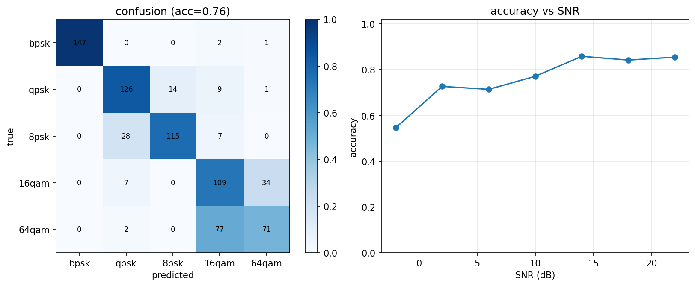
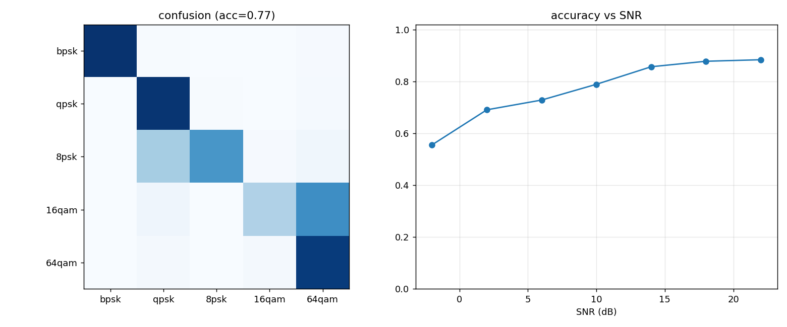

# 10 AMC 自动调制识别

> 代码：`src/phylayer/iqdata.py`（数据集）、`src/phylayer/amc.py`（模型+训练）
> 实验：`experiments/exp05_amc.py`；GPU 训练：`notebooks/amc_kaggle.ipynb`
> 一句话：给接收机加"眼睛"——不看帧结构、不看导频，直接对一段原始 IQ
> 波形判断它用的是哪种调制。

## 它解决什么问题

前面所有模块都假设"我知道对面发的是什么调制"。真实频谱监测/认知无线电
场景里不知道：频谱上看到一个信号，先要识别调制方式才能进一步解调。
这就是 AMC（Automatic Modulation Classification）——本项目把它作为
AI+通信的结合点：前面 M1–M3 造的链路旁路变成**数据工厂**，给深度学习
模型供训练样本。

## 数据集：不是星座图，是"受损的 IQ 波形"

`iqdata.make_iq_sample` 每个样本走一遍真实信道链：

```
随机比特 → 调制 → RRC 成型(sps=8) → 50% 概率多径 → 随机 CFO(±5e-3)
        → 随机相位 → AWGN(随机 SNR) → 随机起点截 1024 点 → 功率归一
```

关键设计：如果给网络看干净星座图，它学到的是"像素模板匹配"；给受损 IQ
波形，它必须学**调制方式的物理本质**——PSK 族恒定包络、QAM 的幅度-
相位联合分布、不同阶数的占据带宽相同但统计形状不同。

5 个类别：`bpsk / qpsk / 8psk / 16qam / 64qam`（故意包含两对"近亲"：
QPSK↔8PSK 都是恒包络，16QAM↔64QAM 都是方形 QAM）。

## 模型：1D-ResNet

```
(2,1024) → Conv1d(2→64,k7)+BN+ReLU
        → 4 × [MaxPool2 + ResBlock64 + ResBlock64]
        → AdaptiveAvgPool → Linear(64→5)
```

- 输入两通道 I/Q——不调成实数幅度/相位，让网络自己学特征；
- ResNet 残差块：深层网络梯度稳定，通信 IQ 分类的常用 backbone
  （O'Shea 的 VT-CNN 和 ResNet 变体是 RML 数据集上的标准 baseline）；
- 全程 1D 卷积在时域上扫——学到的等价于各种高阶统计量/瞬时特征的
  可微分版本；
- 总参数 ~30 万，CPU 上 12 epoch 约 1 分钟，Kaggle T4 上几十秒。

## 实验结果

`exp05_amc.py`：训练 5×800 样本（SNR 均匀采样 -4~24dB），测试 5×150。



- 混合 SNR 总准确率 ~69%，高 SNR 区段 ~78%；
- 混淆矩阵完美呈现**教科书预测的结构**：BPSK 几乎不错；QPSK↔8PSK 互相
  混淆（都是恒包络，区别只在相位集合大小）；16QAM↔64QAM 互相混淆
  （方形 QAM 内部按星座规模区分是最难的子问题）。

这个结果本身就是面试弹药：CNN 自己"发现"了调制分类学里的经典混淆对
——和人类专家用手工特征（瞬时幅度方差、相位差分直方图）得到的结论
一致。

### Kaggle GPU 全量训练

同一模型在 Kaggle T4 上放开数据量（每类 4000 训练 / 1000 测试，25 epoch，
torch 2.10+cu128，约 3 分钟）：混合 SNR 准确率 **76.9%**，高 SNR 端 ~88%。



-4dB 处 ~55% → 22dB 处 ~88%，曲线形态符合"低 SNR 靠恒包络/幅度粗分类、
高 SNR 才能分辨方形 QAM 内部规模"的物理直觉；混淆结构随数据量放大依旧
稳定（PSK 族内、QAM 族内），说明瓶颈在物理可分性而非样本量。
复现路径：`notebooks/amc_kaggle.ipynb`（Kaggle → New Notebook → GPU T4）。

## 面试可能怎么问

**Q：为什么用原始 IQ 而不是星座图/谱图？**
A：星座图需要先同步（定时+CFO）——把最难的问题前置了；原始 IQ 让网络
从信号统计特性出发，端到端。工程上也有星座图+图像 CNN 的路线，但它要
先完成接收机大部分工作，丧失了"AMC 辅助解调"的意义。

**Q：训练数据怎么来？没有标注真实信号怎么办？**
A：本项目的核心优势——**仿真数据工厂**：物理层链路反过来当数据生成
器，可控地扫 SNR/CFO/多径。学术界的标准做法是 O'Shea 的 RadioML
（RML2016）数据集，同样全部是仿真生成。

**Q：sim-to-real gap？**
A：仿真数据训练的模型上真实信号会掉点——信道模型不全（相位噪声、IQ
不平衡、功放非线性）。缓解：域随机化（把更多失真随机加进训练数据）、
真实数据微调。可以坦承这一点并给出改进方向——面试官更看重你知道边界。

**Q：为什么不是 Transformer？**
A：可以做，但 1024 点 IQ 序列上 CNN 的局部归纳偏置已经够好且参数少
两个量级；序列建模（LSTM/Transformer）更适合超长序列或协议级特征。

**Q：混淆矩阵说明什么？**
A：对角线=各类检出率；非对角线揭示混淆结构。这里恒包络族（PSK）内部
混淆、方形 QAM 内部混淆——与手工特征方法的已知结论一致，说明网络学
到的是物理特征不是数据伪影。
